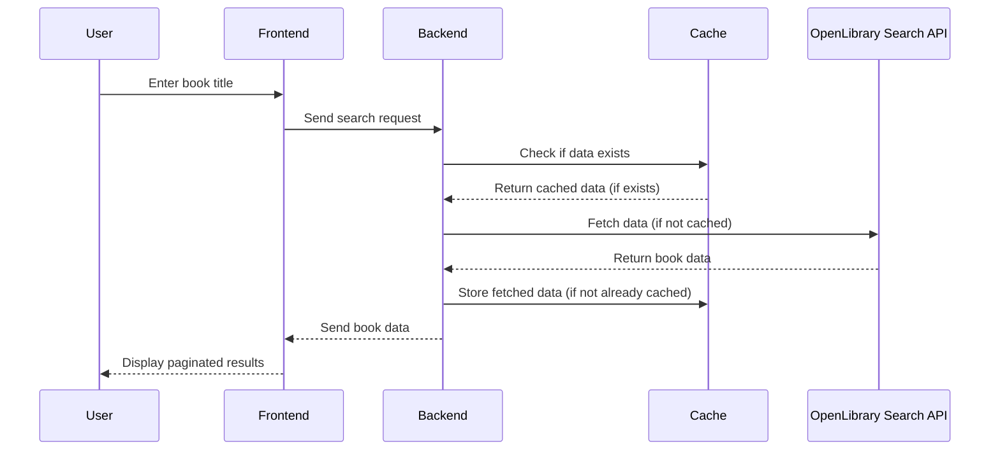
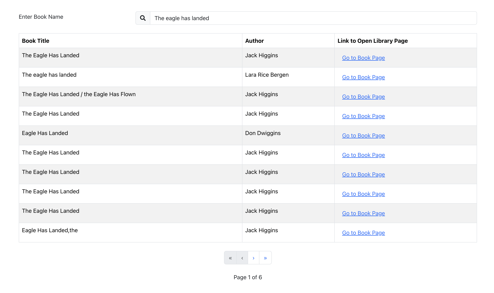

# Bookworm Web Application

## Overview
Bookworm is a simple web-based application that interfaces with the OpenLibrary Search API, allowing users to search for books by titles. The results are presented in a paginated table format. While it provides a convenient interface for users, it also ensures efficient utilization of resources by incorporating a caching mechanism.

## Problem Statement
Searching for books can often be tedious due to the vast number of options available. Users require a streamlined, intuitive interface to quickly search and view book titles. Furthermore, making repeated calls to external APIs can be resource-intensive and could also be limited by API rate limits.

## Solution
Bookworm addresses these problems by:

Providing a user-friendly interface built with React.
Utilizing an ASP.Net Core Web API backend that acts as an intermediary between the frontend and the OpenLibrary Search API.
Implementing a caching mechanism in the backend to minimize direct API calls to OpenLibrary, thus ensuring faster response times and minimizing potential rate-limiting issues.

## Components
- **Frontend (React App)**: User interface for inputting search queries and viewing paginated results.
- **Backend (ASP.Net Core Web API)**: Handles the business logic, interfaces with the OpenLibrary API, and manages the caching mechanism.
- **OpenLibrary Search API**: External API for fetching book data based on user queries.
- **Cache**: Temporarily stores book data fetched from OpenLibrary to minimize redundant calls.



## Dependencies
- **OpenLibrary Search API**: The primary data source for the book information.
- **React**: For building the frontend application.
- **Bootstrap**: For providing a CSS framework to build responsive web applications.
- **React-Bootstrap**: Provides React controls that wrap underlying bootstrap constructs.
- **ASP.Net Core Web API**: For backend logic and server hosting.
- **NSwag**: For generating OpenAPI specifications, API browser and typesafe client libraries
- **Cache Library/Implementation**: Depending on what you've used for caching, like MemoryCache, Redis, etc.

## Constraints
- **Rate Limiting**: Dependence on the OpenLibrary API might mean we are constrained by their rate limits.
- **Search By Book Name**: Currently we only allow users to search by book name. Search by author name and topics could be added in the future.
- **10 Books at a time**: In order keep performance smooth and increase hit rate, only 10 books are displayed at any time.
- **No Personalization**: The application neither allows users to login or create personalizations such as favorite books and lists. This could be added in the future.

## Cache Recommendations

The application offers three caching options:
- **Memory** - This serves as the default caching solution. It's optimal for local development and limited demos operating on a single server due to its ease of setup and rapid response times. However, it's important to note that server memory is a costly resource, which limits cache capacity. In multi-server environments, duplicate cache entries might exist for identical queries. Consequently, Memory caching is not advisable for production scenarios.
- **Redis** - Ideal for medium-scale deployments utilizing fewer than ten backend servers and accommodating user counts in the hundreds. Although Redis doesn't match in-memory cache speeds, it offers exceptionally low latencies. Configuring all servers to utilize a singular Redis instance ensures a shared cache, enhancing the hit rate and more efficient resource utilization. Users have the option to configure Redis for either memory or storage, allowing for a balance between cost and latency considerations. Nonetheless, Redis can be resource-intensive, primarily due to its memory-driven architecture. While scalable, Redis does possess scalability limits, especially when contrasted with alternative caching solutions.
- **SQL** - For medium to large scale deployments, SQL stands out as the preferred caching mechanism. SQL Server or Azure SQL can act as the underlying storage system. Even though SQL might introduce higher latencies compared to the other options, it often surpasses the speed of many remote network calls. Moreover, scaling SQL Server or Azure SQL to manage extensive cache volumes and loads is relatively straightforward.

# Running Locally

## Using Docker

This is the easiest way to run the application if you have docker installed. Open a terminal at the root directory and run the following command

```
docker compose up
```

This command will download docker images for dependencies and proceed to build the frontend and backend code. These steps will only need to be run significantly reducing the overhead of launching in future runs. Once all the containers have successfully started navigate to [http://localhost:4000/](http://localhost:4000/)

You should see the bookworm web interface which should look similar to the screenshot below. You can now type in any book name to search. The UI will initiate a search 500ms after you stop typing to reduce server load. There is no need to hit enter or press any buttons after typing in a book name. You can use the pagination controls at the bottom if there are more than 10 results per query.


